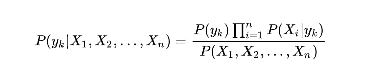

# Naive-Bayes-Classifier
My own implementation on well-known probability method - Naive Bayes Classifier

This way of classification rely on the Bayes Theorem of dependent probability:
<figure style="float:display:block; margin-left: auto; margin-right: auto;">
	
</figure>

By this, we can transform our probability into this:
<figure style="float:display:block; margin-left: auto; margin-right: auto;">
	
</figure>

Moreover, if we suppose that all our features are independent we can expect that:
<figure style="float:display:block; margin-left: auto; margin-right: auto;">
	
</figure>

Of course, this is quite confident assumption that all these features are independent. In real life we have a correlation between
features. That's why our classificator is called NAIVE. And it is assumed that this classificator is used as a baseline or as
a solution for small and simple datasets. 

If you want to use my classificator, you can not think about scaling of categorical features using OHE, or numerical features, using StandarScaler.
This is all because i do it by myself inside. But you can vary it by set transform=False. Also, all numeric features count their probality by
Gaussian formula:

<figure style="float:display:block; margin-left: auto; margin-right: auto;">
	
</figure>

- x_i - the specific value of numeric featur
- sigma - variation of feature that has same target as X_i
- mean - mean of feature that has same target as X_i
